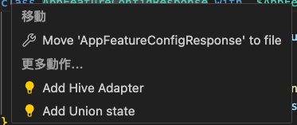
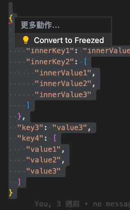
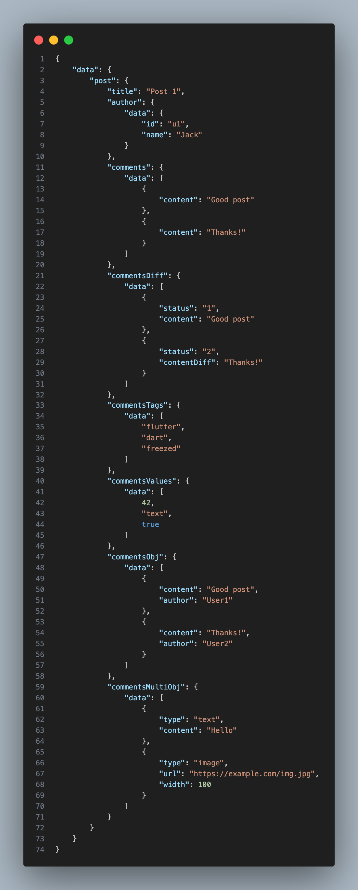
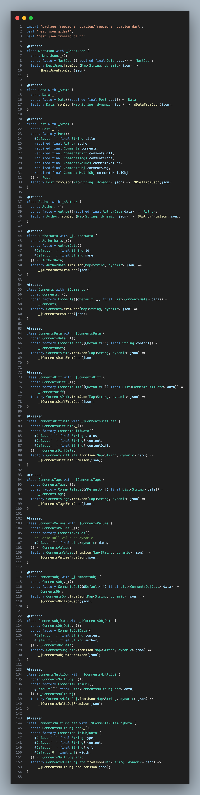

### Show for Freezed Classes
Quick fixes will only be activated when a verified JSON string is selected.

#### Available Actions:
- **Add Hive Adapter**
  - Only shown when the project includes the `hive` dependency.
  - Converts the current Freezed class into a Hive-compatible structure.
  - Searches for the last used `typeId` within the project.
  - Automatically adds `Hive.registerAdapter()` in the appropriate location.

- **Add Union State**
  - Adds support for union types in Freezed classes.

---

### JSON to Freezed
Quick fixes will only be activated when a verified JSON string is selected.

#### Features:
- Auto-generates Dart models from JSON structures.
- [See more json](./test/lib/complex_json/sample.json) 
- [See more Generation](./test/lib/complex_json/complex_json.dart) 
- **Quick fix**

- **Nested JSON Support**
  
  - example file: `nest_json.dart`

- **Freezed Model Generation**
  - Automatically creates `@freezed`-based classes for nested JSON.

